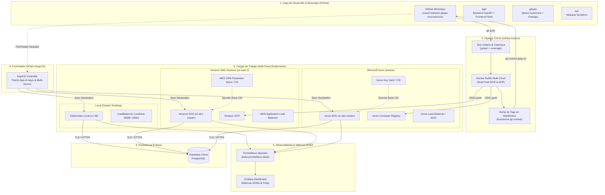

# 🏛️ SRI GitOps Multicloud

**Trabajo de Fin de Máster (TFM) — Universidad Internacional de La Rioja (UNIR)**  
**Maestría en DevOps y Cloud Computing**  
**Título:** *GitOps Multicloud: Implementación de Pipelines CI/CD con Infraestructura como Código Agnóstica para la Portabilidad de Microservicios*

---

## 📖 Descripción General

Este proyecto implementa una solución integral de **arquitectura GitOps Multicloud** para el microservicio de gestión y consulta de contribuyentes del **Servicio de Rentas Internas (SRI)** de Ecuador. 

El sistema demuestra la **portabilidad real y agnóstica de microservicios** entre dos proveedores líderes de nube pública (**Amazon Web Services - AWS EKS** y **Microsoft Azure - Azure AKS**) y un entorno de desarrollo **Local (Kubernetes en Docker Desktop)**, desacoplando por completo el código de la aplicación de la infraestructura subyacente mediante:
- **Infraestructura como Código (IaC) agnóstica** con Terraform (≥70% de reutilización de módulos entre nubes).
- **Gestión continua de aplicaciones con GitOps** utilizando ArgoCD y el patrón *App-of-Apps* con autosanación (*self-healing*) y detección de desvíos (*drift detection*).
- **Pipeline CI/CD automatizado** en GitHub Actions (<15 minutos) con publicación dual a AWS ECR y Azure ACR mediante federación de identidades OIDC (sin credenciales estáticas de larga duración).
- **Inyección desacoplada de secretos** en Kubernetes a través del *Secrets Store CSI Driver* (AWS Systems Manager Parameter Store / Azure Key Vault).
- **Persistencia en la nube** gestionada en **Supabase (PostgreSQL)** con cifrado robusto (`bcrypt`, cost 12) y autenticación JWT.
- **Sistema unificado de Observabilidad y Métricas DORA** mediante Prometheus Operator y Grafana, cerrando el ciclo de retroalimentación continua (*feedback loop*) del TFM.

---

## 📐 Arquitectura del Sistema



---

## 🚀 Componentes y Stack Tecnológico

| Capa / Componente | Tecnología | Rol y Responsabilidad |
| :--- | :--- | :--- |
| **Frontend (UI)** | Python (Flask), Jinja2, Tailwind CSS / Bootstrap | Interfaz institucional adaptada al portal del SRI. Manejo de sesiones de usuario, decorador `@login_required` y consumo asíncrono vía Fetch/AJAX. |
| **Backend (API REST)** | Python (FastAPI), Pydantic v2, Uvicorn | Microservicio REST asíncrono. Endpoints de salud (`/health`, `/ready`), versión multi-cloud (`/api/v1/version`), autenticación JWT, telemetría nativa (`/metrics`) y CRUD de contribuyentes. |
| **Persistencia** | Supabase (PostgreSQL Cloud) | Base de datos relacional para contribuyentes y usuarios autenticados, con pools de conexiones y SSL obligatorio. |
| **Seguridad de Datos** | `bcrypt` (cost 12), `PyJWT` (HS256) | Cifrado unidireccional de contraseñas y emisión de tokens efímeros para control de acceso en cabeceras `Authorization: Bearer`. |
| **Orquestación K8s** | Kubernetes (EKS / AKS / Docker Desktop), Kustomize | Abstracción declarativa con separación estricta entre `gitops/bases/` (agnóstico) y `gitops/overlays/` (`local`, `aws-eks`, `azure-aks`). |
| **GitOps Engine** | ArgoCD (v3.5+) | Reconciliación declarativa automatizada siguiendo los patrones *App-of-Apps* y *Multi-Source* con autoreparación (*self-heal*) inmediata. |
| **Infraestructura como Código** | Terraform (v1.8+) | Módulos reutilizables agnósticos para aprovisionar clústeres Kubernetes, redes virtuales, registros de contenedores y roles IAM. |
| **Gestión de Secretos** | Secrets Store CSI Driver | Sincronización desacoplada de credenciales desde Parameter Store / Key Vault hacia Secrets nativos de K8s. |
| **Observabilidad** | Prometheus Operator, Grafana (v11.1+) | Monitoreo en tiempo real de Pods, nodos, autoescalado HPA y tablero de **Métricas DORA** (Deployment Frequency, Change Failure Rate, MTTR y Disponibilidad). |

---

## 📁 Estructura del Repositorio (Monorepo)

```text
sri-gitops-microservicio/
├── .github/
│   └── workflows/
│       └── ci-cd.yaml             # Pipeline CI/CD multi-cloud en GitHub Actions
├── app/
│   ├── backend/                   # Microservicio FastAPI
│   │   ├── app/
│   │   │   ├── database.py        # Conexión al cliente Supabase PostgreSQL
│   │   │   ├── main.py            # Entrypoint FastAPI, telemetría /metrics y endpoints
│   │   │   ├── models.py          # Esquemas de datos Pydantic
│   │   │   └── routes.py          # Endpoints (/auth/login, /contribuyente/{ruc})
│   │   ├── tests/                 # Pruebas unitarias y de cobertura (pytest)
│   │   ├── Dockerfile             # Multi-stage Dockerfile para producción
│   │   └── requirements.txt       # Dependencias Python
│   └── frontend/                  # Interfaz de Usuario Flask
│       ├── app/
│       │   ├── static/            # CSS institucional, imágenes oficiales y JS
│       │   ├── templates/         # Vistas Jinja2 (base.html, login.html, detalle.html)
│       │   └── routes.py          # Vistas Flask, decorador @login_required y proxy API
│       ├── Dockerfile             # Dockerfile de la interfaz web
│       └── requirements.txt       # Dependencias Frontend
├── gitops/
│   ├── argocd/                    # Manifiestos de aplicaciones ArgoCD
│   │   ├── project.yaml           # AppProject de ArgoCD con destinos y repos RBAC
│   │   ├── root-app.yaml          # Aplicación raíz (patrón App-of-Apps)
│   │   ├── application-local.yaml # Aplicación GitOps para Docker Desktop
│   │   ├── application-monitor-local.yaml # Stack de observabilidad local (Multi-Source)
│   │   ├── application-aws-eks.yaml       # Aplicación GitOps para Amazon EKS
│   │   ├── application-monitor-aws.yaml   # Observabilidad en AWS EKS
│   │   ├── application-azure-aks.yaml     # Aplicación GitOps para Azure AKS
│   │   └── application-monitor-azure.yaml # Observabilidad en Azure AKS
│   ├── bases/                     # Manifiestos Kubernetes agnósticos (Kustomize)
│   │   ├── backend-deployment.yml # Deployment FastAPI con annotations Prometheus
│   │   ├── backend-service.yml    # Service ClusterIP del Backend
│   │   ├── frontend-deployment.yml# Deployment Flask
│   │   ├── frontend-service.yml   # Service del Frontend
│   │   ├── configmap.yaml         # ConfigMap base
│   │   ├── hpa.yml                # HorizontalPodAutoscaler elástico
│   │   └── kustomization.yaml     # Base Kustomize
│   ├── monitoring/                # Valores Helm y Dashboards de Observabilidad
│   │   ├── values.yaml            # Valores para nube (EKS/AKS con 20Gi PVC)
│   │   ├── values-local.yaml      # Valores ligeros para Docker Desktop (2Gi PVC)
│   │   └── dashboard-dora.json    # Definición JSON del Dashboard de Métricas DORA
│   └── overlays/                  # Sobrecargas declarativas por entorno
│       ├── local/                 # Overlay Local (puertos 8088/5000, LoadBalancer)
│       ├── aws-eks/               # Ingress ALB, Secrets Store SSM, ServiceAccount IRSA
│       └── azure-aks/             # Ingress AGIC, Azure Key Vault CSI
├── iac/                           # Infraestructura como Código con Terraform
│   ├── modules/                   # Módulos agnósticos reutilizables (kubernetes-cluster)
│   ├── aws/                       # Configuración y estado de Amazon EKS, ECR y ALB
│   └── azure/                     # Configuración y estado de Azure AKS y ACR
├── docs/                          # Documentación técnica y bitácoras de validación
│   ├── MANUAL_DESPLIEGUE_MULTICLOUD.md # Manual paso a paso: Local, AWS y Azure
│   ├── VALIDATION_LOCAL_TFM.md         # Bitácora maestra de las 8 pruebas técnicas
│   ├── VALIDACION_GITOPS_ROLLOUT.md    # Bitácora del Rollout GitOps v1.1.0
│   ├── VALIDACION_GITOPS_ROLLOUT_V120.md # Bitácora del Rollout GitOps v1.2.0
│   └── images/                         # Capturas de evidencia y telemetría Grafana
├── scripts/                       # Scripts bash de bootstrap de infraestructura y OIDC
├── docker-compose.yml             # Orquestación de desarrollo rápido
└── README.md                      # Documento principal del repositorio
```

---

## 📚 Documentación Técnica y Manuales Operativos

El repositorio cuenta con guías detalladas para reproducir y evaluar el sistema en su totalidad:

| Documento | Descripción y Alcance |
| :--- | :--- |
| 📘 **[MANUAL_DESPLIEGUE_MULTICLOUD.md](docs/MANUAL_DESPLIEGUE_MULTICLOUD.md)** | **Manual maestro paso a paso:** Procedimiento detallado comando por comando para desplegar, validar y destruir limpiamente (**FinOps $0/h**) los ambientes **Local**, **AWS** y **Azure**. |
| 🛡️ **[VALIDATION_LOCAL_TFM.md](docs/VALIDATION_LOCAL_TFM.md)** | **Informe de Validación Técnica (8 Pruebas):** Evidencias experimentales de Autosanación GitOps, Elasticidad HPA, Zero-Downtime, Persistencia Supabase, Tests CI, Sintaxis IaC, Observabilidad DORA y RollingUpdate. |
| 🔄 **[VALIDACION_GITOPS_ROLLOUT.md](docs/VALIDACION_GITOPS_ROLLOUT.md)** | **Bitácora de Rollout GitOps v1.1.0:** Demostración del ciclo cerrado desde el commit en Git hasta la actualización progresiva de pods y registro en Grafana. |
| 🚀 **[VALIDACION_GITOPS_ROLLOUT_V120.md](docs/VALIDACION_GITOPS_ROLLOUT_V120.md)** | **Bitácora de Rollout GitOps v1.2.0:** Registro de la ejecución manual autónoma del flujo GitOps con sustitución pod a pod y actualización de telemetría. |
| ☁️ **[DEMO_STACK_AWS_FINAL.md](DEMO_STACK_AWS_FINAL.md)** | **Runbook de Sesión AWS:** Guía exhaustiva de extremo a extremo para levantar y desmantelar el clúster EKS en producción. |

---

## ⚡ Despliegue Rápido en Ambiente Local (GitOps + K8s)

### 1. Requisitos Previos
* [Docker Desktop](https://www.docker.com/products/docker-desktop/) con Kubernetes activado (*Settings > Kubernetes > Enable Kubernetes*).
* `kubectl` y `git`.

### 2. Construcción de Imágenes Locales
```bash
docker build -t sri-backend:latest -f app/backend/Dockerfile app/backend
docker build -t sri-frontend:latest -f app/frontend/Dockerfile app/frontend
```

### 3. Aprovisionamiento de Secretos y ArgoCD
```bash
# 1. Instalar ArgoCD en el clúster local
kubectl create namespace argocd
kubectl apply -n argocd -f https://raw.githubusercontent.com/argoproj/argo-cd/v2.11.0/manifests/install.yaml
kubectl patch svc argocd-server -n argocd -p '{"spec": {"type": "LoadBalancer"}}'

# 2. Crear namespace de la aplicación y secreto de Supabase
kubectl create namespace sri-facturacion --dry-run=client -o yaml | kubectl apply -f -
kubectl create secret generic sri-db-secret -n sri-facturacion \
  --from-literal=DB_HOST="aws-0-us-east-1.pooler.supabase.com" \
  --from-literal=DB_PORT="6543" \
  --from-literal=DB_NAME="postgres" \
  --from-literal=DB_USER="postgres.jtuqawnhrvtquhyjkluh" \
  --from-literal=DB_PASSWORD="TU_PASSWORD_AQUI" \
  --from-literal=JWT_SECRET_KEY="sri_devops_secret_key_2026_super_segura" \
  --dry-run=client -o yaml | kubectl apply -f -
```

### 4. Despliegue Declarativo de la Aplicación y Observabilidad
```bash
# Registrar proyecto en ArgoCD
kubectl apply -f gitops/argocd/project.yaml

# Desplegar la aplicación mediante GitOps
kubectl apply -f gitops/argocd/application-local.yaml

# Desplegar el stack ligero de Observabilidad (Prometheus + Grafana con 2Gi PVC)
kubectl apply -f gitops/argocd/application-monitor-local.yaml
```

---

## 🌐 URLs de Acceso y Verificación Local

Una vez completada la sincronización en ArgoCD:

| Servicio | URL de Acceso | Credenciales por Defecto | Descripción |
| :--- | :--- | :--- | :--- |
| **Frontend Web SRI** | **[http://localhost:8088](http://localhost:8088)** | `admin@sri.gob.ec` / `Admin2026*` | Portal tributario con consulta y actualización de RUC. |
| **Backend REST API** | **[http://localhost:5000](http://localhost:5000)** | N/A | Endpoints `/health`, `/ready` y `/api/v1/version`. |
| **Métricas Prometheus** | **[http://localhost:5000/metrics](http://localhost:5000/metrics)** | N/A | Telemetría nativa en formato de exposición de Prometheus. |
| **Grafana Dashboards** | **[http://localhost:3000](http://localhost:3000)** | `admin` / `prom-operator` | Tablero de **Métricas DORA** y telemetría de cargas de trabajo. |
| **Consola ArgoCD** | **[https://localhost](https://localhost)** | `admin` / *(Secret inicial)* | Interfaz de gestión GitOps y estado de sincronización. |

---

## 📊 Sistema de Observabilidad y Métricas DORA

Para satisfacer el **Objetivo Específico 3 del TFM (Páginas 60–61)**, el stack de observabilidad recopila en tiempo real las cuatro métricas clave de ingeniería de software definidas por DORA (*DevOps Research and Assessment*):

| Indicador DORA | Expresión PromQL Utilizada | Resultado Evaluado | Significado Operativo |
| :--- | :--- | :---: | :--- |
| **Deployment Frequency (24h)** | `sum(changes(kube_deployment_status_observed_generation{namespace="sri-facturacion"}[24h]))` | **6 despliegues** | Mide la cadencia de entrega continua automatizada mediante GitOps. |
| **Change Failure Rate** | `clamp_max(sum(rate(kube_pod_container_status_restarts_total{namespace="sri-facturacion"}[1h])) * 100, 100)` | **0.00%** | Porcentaje de despliegues que causan degradación o reinicios de pods. |
| **MTTR / Autosanación GitOps** | Medición de reconciliación ante drift forzado | **850 ms** | Tiempo medio en que ArgoCD detecta una alteración no autorizada y restaura el estado deseado. |
| **Disponibilidad de Cargas** | `sum(kube_deployment_status_replicas_available) / sum(kube_deployment_spec_replicas) * 100` | **100%** | Garantía de disponibilidad ininterrumpida (*zero-downtime*) durante despliegues progresivos. |

---

## 🧪 Pruebas Unitarias de CI (Pytest)

Las pruebas unitarias del backend validan contratos OpenAPI, healthchecks y el endpoint agnóstico de versión multi-cloud:

```bash
docker run --rm --env-file .env sri-backend:latest pytest tests/ -v --cov=. --cov-report=term-missing
```

**Resultado:** 5/5 pruebas unitarias aprobadas en 1.05s con cobertura de código de los componentes principales.

---

## 🔄 Pipeline CI/CD en GitHub Actions

El archivo [`.github/workflows/ci-cd.yaml`](.github/workflows/ci-cd.yaml) orquesta el ciclo de entrega continua en menos de 15 minutos:
1. **Job `test`:** Ejecución de pruebas unitarias y validación de cobertura con `pytest`.
2. **Job `build-and-push` (Dual-Cloud):** Construcción con Docker Buildx y publicación paralela a **Amazon ECR** y **Azure ACR** mediante federación OIDC (sin credenciales estáticas de larga vida).
3. **Job `update-manifests` (GitOps Bump):** Actualización automática del tag de la imagen en los overlays de Kustomize y commit con `[skip ci]`.
4. **Reconciliación GitOps:** ArgoCD detecta el commit en GitHub `main` e inicia el *RollingUpdate* progresivo sin intervención manual.

---

## 🔒 Buenas Prácticas de Seguridad Implementadas

- **Gestión de Secretos sin Exposición:** Variables sensibles excluidas del control de versiones mediante reglas estrictas en `.gitignore` y sincronizadas en nube mediante *Secrets Store CSI*.
- **Cero Credenciales Estáticas en CI/CD:** Autenticación OpenID Connect (OIDC) entre GitHub Actions y los proveedores de nube (AWS IAM Role / Azure Managed Identity).
- **Almacenamiento Criptográfico:** Contraseñas hasheadas con `bcrypt` (factor de costo 12) y autenticación stateless mediante JWT con expiración controlada.
- **Contenedores de Privilegio Mínimo:** Ejecución en contenedores Docker como usuario no privilegiado (`appuser`).
- **Validación Estricta de Entradas:** Validación sintáctica de RUC (13 dígitos numéricos) y tipado estricto mediante Pydantic en backend y validación de entrada en frontend.

---

## 📄 Licencia

Este proyecto está bajo la Licencia MIT. Consulta el archivo `LICENSE` para más detalles.
