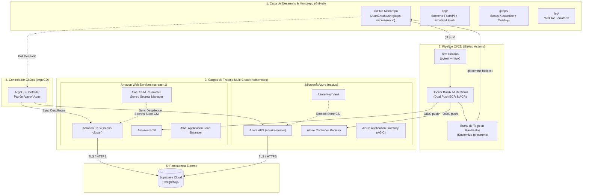

# 🏛️ SRI GitOps Multicloud

**Trabajo de Fin de Máster (TFM) — Universidad Internacional de La Rioja (UNIR)**  
**Maestría en DevOps y Cloud Computing**  
**Título:** *GitOps Multicloud: Implementación de Pipelines CI/CD con Infraestructura como Código Agnóstica para la Portabilidad de Microservicios*

---

## 📖 Descripción General

Este proyecto implementa una solución integral de **arquitectura GitOps Multicloud** para el microservicio de gestión y consulta de contribuyentes del **Servicio de Rentas Internas (SRI)** de Ecuador. 

El sistema demuestra la **portabilidad real y agnóstica de microservicios** entre dos proveedores líderes de nube pública (**Amazon Web Services - AWS EKS** y **Microsoft Azure - Azure AKS**), desacoplando por completo el código de la aplicación de la infraestructura subyacente mediante:
- **Infraestructura como Código (IaC) agnóstica** con Terraform (≥70% de reutilización de módulos).
- **Gestión continua de aplicaciones con GitOps** utilizando ArgoCD y el patrón *App-of-Apps*.
- **Pipeline CI/CD automatizado** en GitHub Actions (<15 minutos) con publicación dual a AWS ECR y Azure ACR mediante federación de identidades OIDC (sin claves de larga duración).
- **Inyección desacoplada de secretos** en Kubernetes a través del *Secrets Store CSI Driver* (AWS Systems Manager Parameter Store / Azure Key Vault).
- **Persistencia en la nube** gestionada en **Supabase (PostgreSQL)** con cifrado robusto de credenciales.

---

## 📐 Arquitectura del Sistema



---

## 🚀 Componentes y Stack Tecnológico

| Capa / Componente | Tecnología | Rol y Responsabilidad |
| :--- | :--- | :--- |
| **Frontend (UI)** | Python (Flask), Jinja2, Tailwind CSS | Interfaz institucional adaptada al portal del SRI. Manejo de sesiones de usuario y consumo reactivo de API vía Fetch/AJAX. |
| **Backend (API REST)** | Python (FastAPI), Pydantic v2, Uvicorn | Microservicio REST asíncrono de alto rendimiento. Endpoints de salud (`/health`, `/ready`), versión multi-cloud (`/api/v1/version`), autenticación OAuth2/JWT y CRUD de contribuyentes. |
| **Persistencia** | Supabase (PostgreSQL Cloud) | Base de datos relacional para contribuyentes y usuarios, consumida vía API REST mediante el SDK oficial. |
| **Seguridad de Datos** | `bcrypt` (cost 12), `PyJWT` (HS256) | Cifrado unidireccional de contraseñas y emisión de tokens efímeros para control de acceso. |
| **Contenerización Local** | Docker, Docker Compose (Multi-stage) | Aislamiento en contenedores ligeros basados en `python:3.11-slim` con healthchecks activos. |
| **Orquestación K8s** | Kubernetes (EKS / AKS), Kustomize | Abstracción declarativa con separación estricta entre `gitops/bases/` (común) y `gitops/overlays/` (específico de cada nube). |
| **GitOps** | ArgoCD (v3.5+) | Reconciliación declarativa automatizada siguiendo el patrón *App-of-Apps* con autorepair y prune activo. |
| **Infraestructura como Código** | Terraform (v1.5+) | Módulos reutilizables agnósticos para aprovisionar clústeres Kubernetes, VPC/VNet, registros y roles IAM. |
| **Gestión de Secretos** | Secrets Store CSI Driver | Sincronización nativa de secretos en volúmenes temporales hacia variables de entorno K8s. |
| **Observabilidad** | Kube-Prometheus-Stack, Grafana | Métricas en tiempo real de infraestructura, Pods y latencias de microservicio. |

---

## 📁 Estructura del Repositorio (Monorepo)

```text
sri-gitops-microservicio/
├── .github/
│   └── workflows/
│       └── ci-cd.yaml             # Pipeline CI/CD multi-cloud en GitHub Actions
├── app/
│   ├── backend/                   # Microservicio FastAPI
│   │   ├── app/
│   │   │   ├── database.py        # Conexión al cliente Supabase
│   │   │   ├── main.py            # Entrypoint FastAPI, middlewares y endpoints base
│   │   │   ├── models.py          # Esquemas de datos Pydantic
│   │   │   └── routes.py          # Endpoints (/auth/login, /contribuyente/{ruc})
│   │   ├── tests/                 # Pruebas unitarias (test_health.py)
│   │   ├── Dockerfile             # Multi-stage Dockerfile para producción
│   │   ├── requirements.txt       # Dependencias Python
│   │   ├── reset_password.py      # Utilidad CLI para reseteo de claves
│   │   └── init_db.py             # Script de inicialización de esquema
│   └── frontend/                  # Interfaz de Usuario Flask
│       ├── app/
│       │   ├── static/            # CSS, imágenes institucionales y JS
│       │   ├── templates/         # Vistas HTML (login.html, detalle.html)
│       │   └── routes.py          # Vistas Flask, decorador @login_required y proxy API
│       ├── Dockerfile             # Dockerfile de la interfaz web
│       └── requirements.txt       # Dependencias Frontend
├── gitops/
│   ├── argocd/                    # Manifiestos de aplicaciones ArgoCD (App-of-Apps)
│   │   ├── root-app.yaml          # Aplicación raíz que orquesta los overlays
│   │   ├── project.yaml           # AppProject de ArgoCD con RBAC
│   │   ├── application-aws-eks.yaml
│   │   └── application-azure-aks.yaml
│   ├── bases/                     # Manifiestos Kubernetes agnósticos (Kustomize)
│   │   ├── backend-deployment.yml
│   │   ├── backend-service.yml
│   │   ├── frontend-deployment.yml
│   │   ├── frontend-service.yml
│   │   ├── configmap.yaml
│   │   ├── hpa.yml
│   │   └── kustomization.yaml
│   └── overlays/                  # Sobrecargas específicas por nube
│       ├── aws-eks/               # Ingress ALB, Secrets Store SSM, ServiceAccount IRSA
│       └── azure-aks/             # Ingress AGIC, Azure Key Vault CSI
├── iac/                           # Infraestructura como Código con Terraform
│   ├── modules/                   # Módulos agnósticos reutilizables (kubernetes-cluster)
│   ├── aws/                       # Configuración y estado de Amazon EKS y ECR
│   └── azure/                     # Configuración y estado de Azure AKS y ACR
├── diagramas/                     # Evidencias arquitectónicas y diagramas
├── docs/                          # Runbooks y documentación técnica de validación
├── scripts/                       # Scripts bash de bootstrap de infraestructura y OIDC
├── docker-compose.yml             # Orquestación para pruebas locales
├── .env.example                   # Plantilla de variables de entorno seguras
└── README.md                      # Documento principal del proyecto
```

---

## ⚙️ Guía de Ejecución y Pruebas Locales

El proyecto incluye un entorno local 100% reproducible mediante **Docker Compose**, lo que permite verificar la aplicación antes de cualquier despliegue a Kubernetes o a las nubes públicas.

### 1. Requisitos Previos
- [Docker Desktop](https://www.docker.com/products/docker-desktop/) instalado y en ejecución.
- Git instalado.
- Cuenta en [Supabase](https://supabase.com/) con el proyecto y tabla `contribuyentes` configurados.

### 2. Configurar Variables de Entorno
Copia la plantilla `.env.example` para generar tu archivo `.env`:

```powershell
Copy-Item .env.example .env
```

Configura tus credenciales reales en `.env`:
```env
ENVIRONMENT=development
SUPABASE_URL=https://tu-proyecto.supabase.co
SUPABASE_KEY=tu-anon-key-de-supabase
JWT_SECRET=tu-clave-secreta-jwt
FLASK_SECRET_KEY=tu-clave-secreta-flask
BACKEND_URL=http://localhost:5000
PUBLIC_BACKEND_URL=http://localhost:5000
```

### 3. Levantar los Servicios Locales
Ejecuta el compose con construcción de imágenes:

```powershell
docker-compose up --build -d
```

Verifica el estado saludable de los contenedores:
```powershell
docker-compose ps
```

Ambos contenedores deben figurar en estado `healthy` / `running`:
- Backend API: `http://localhost:5000`
- Frontend Web: `http://localhost:8080`

### 4. Verificación de Endpoints del Backend
Puedes comprobar el funcionamiento de la API mediante PowerShell o curl:

```powershell
# Health Check (Liveness Probe K8s)
curl http://localhost:5000/health

# Readiness Check (Readiness Probe K8s)
curl http://localhost:5000/ready

# Endpoint de versión (portabilidad multi-cloud)
curl http://localhost:5000/api/v1/version
```

### 5. Acceso al Frontend y Prueba de Autenticación
1. Abre tu navegador web en: **[http://localhost:8080](http://localhost:8080)**.
2. El sistema redirigirá automáticamente a la pantalla de Login del SRI.
3. Ingresa con las credenciales de prueba configuradas:
   - **RUC:** `1790011674001`
   - **Contraseña:** `1234`
4. Al ingresar, el sistema validará el token JWT, creará la sesión segura y te redirigirá a `/detalle`, donde se cargan y pueden actualizarse los datos fiscales del contribuyente.

### 6. Reseteo de Contraseñas (Utilidad CLI)
Si necesitas cambiar la clave de acceso de cualquier contribuyente en Supabase:

```powershell
docker exec sri-gitops-microservicio-backend-1 python reset_password.py <RUC> <NUEVA_CLAVE>
```

---

## 🧪 Pruebas Automatizadas (Pytest)

Las pruebas unitarias del backend validan los endpoints de salud, probes y versionado:

```powershell
# Dentro del contenedor del backend:
docker exec sri-gitops-microservicio-backend-1 pytest -v --cov=. --cov-report=term-missing
```

---

## ☸️ Validación de Manifiestos K8s (Kustomize)

El diseño de Kustomize permite compilar y verificar la sintaxis de los manifiestos localmente sin necesidad de un clúster activo:

```powershell
# 1. Validar Manifiestos Base Agnósticos
kubectl kustomize gitops/bases/

# 2. Validar Overlay de AWS EKS (ALB Ingress + SSM CSI)
kubectl kustomize gitops/overlays/aws-eks/

# 3. Validar Overlay de Azure AKS (AGIC Ingress + Key Vault CSI)
kubectl kustomize gitops/overlays/azure-aks/
```

---

## 🔄 Pipeline CI/CD en GitHub Actions

El archivo [`.github/workflows/ci-cd.yaml`](.github/workflows/ci-cd.yaml) orquesta el ciclo de entrega continua en menos de 15 minutos dividido en 3 etapas:

1. **Job `test`:**
   - Entorno Python 3.12 aislado.
   - Ejecución de suite de pruebas unitarias y cobertura con `pytest`.
2. **Job `build-and-push` (Matrix Dual-Cloud):**
   - Construcción paralela con Docker Buildx para `backend` y `frontend`.
   - Autenticación federada OIDC contra AWS y Azure (cero credenciales estáticas en GitHub).
   - Publicación de imágenes versionadas con el SHA del commit (`:${{ github.sha }}`) y `:latest` en Amazon ECR y Azure ACR.
3. **Job `update-manifests` (GitOps Bump):**
   - Kustomize actualiza automáticamente el tag de la imagen en los archivos `kustomization.yaml` de los overlays.
   - Realiza un commit con `[skip ci]` para que ArgoCD detecte el cambio de versión y sincronice el despliegue de inmediato.

---

## 🔒 Buenas Prácticas de Seguridad Implementadas

- **Gestión de Secretos sin Exposición:** Las credenciales y claves privadas están excluidas del control de versiones mediante reglas estrictas en `.gitignore`.
- **Cero Credenciales Estáticas en CI/CD:** Se utiliza autenticación OpenID Connect (OIDC) entre GitHub Actions y los proveedores de nube (AWS IAM Role / Azure Managed Identity).
- **Almacenamiento Criptográfico:** Hashes generados con `bcrypt` (factor de costo 12) y autenticación stateless mediante JWT con expiración controlada.
- **Contenedores de Privilegio Mínimo:** Ejecución en contenedores Docker como usuario no privilegiado (`appuser`).
- **Validación Estricta de Entradas:** Validación sintáctica de RUC (13 dígitos numéricos) y tipado estricto mediante Pydantic en backend y validación nativa en frontend.

---

## 📄 Licencia

Este proyecto está bajo la Licencia MIT. Consulta el archivo `LICENSE` para más detalles.
