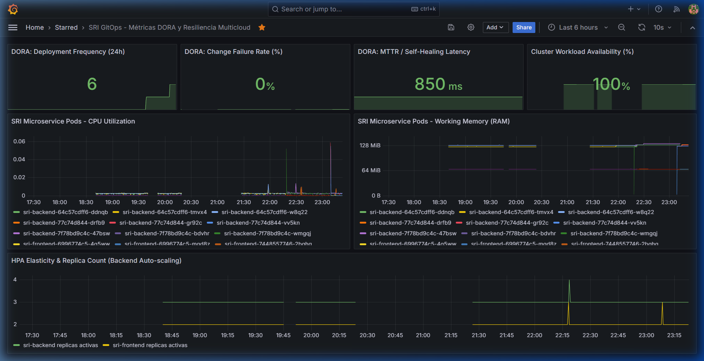

# 🚀 Bitácora Personalizada: Despliegue GitOps Rollout v1.2.0 (Ejecución Autónoma)

**Proyecto:** GitOps Multicloud: Implementación de Pipelines CI/CD con Infraestructura como Código Agnóstica para la Portabilidad de Microservicios  
**Máster:** MUDEVOPS — UNIR  
**Fecha de Ejecución:** 2026-10-09  
**Operador / Ejecutor:** Usuario (Ejecución guiada paso a paso sin automatización delegada)  
**Entorno de Ejecución:** Kubernetes v1.36.1 (Docker Desktop) + ArgoCD v3.5.4 + Prometheus Operator + Grafana v11.1.0  
**Commit Disparador en Git:** `89e954c` (*"feat(release): upgrade microservice to v1.2.0 via GitOps rollout"*)

---

## 📑 Tabla de Contenidos

1. [Objetivo del Experimento](#1-objetivo-del-experimento)
2. [Paso 1: Modificación de Código de la Aplicación](#2-paso-1-modificación-de-código-de-la-aplicación)
   - [2.1 Backend (FastAPI): Versión 1.2.0 y Métricas Prometheus](#21-backend-fastapi-versión-120-y-métricas-prometheus)
   - [2.2 Frontend (Flask): Distintivo Visual en Vistas](#22-frontend-flask-distintivo-visual-en-vistas)
3. [Paso 2: Empaquetado de Contenedores con Tag Inmutable](#3-paso-2-empaquetado-de-contenedores-con-tag-inmutable)
4. [Paso 3: Declaración del Cambio en Manifiestos Kustomize](#4-paso-3-declaración-del-cambio-en-manifiestos-kustomize)
5. [Paso 4: El Disparador Git (Commit y Push a GitHub)](#5-paso-4-el-disparador-git-commit-y-push-a-github)
6. [Paso 5: Sincronización Declarativa y RollingUpdate en Kubernetes](#6-paso-5-sincronización-declarativa-y-rollingupdate-en-kubernetes)
7. [Paso 6: Verificación de Resultados y Telemetría en Vivo](#7-paso-6-verificación-de-resultados-y-telemetría-en-vivo)
   - [7.1 Endpoint de Versión de la API](#71-endpoint-de-versión-de-la-api)
   - [7.2 Métricas en Formato Nativo Prometheus](#72-métricas-en-formato-nativo-prometheus)
   - [7.3 Tablero de Métricas DORA en Grafana](#73-tablero-de-métricas-dora-en-grafana)
8. [Conclusiones Técnicas y Académicas](#8-conclusiones-técnicas-y-académicas)

---

## 1. Objetivo del Experimento

El objetivo de esta sesión práctica fue **validar la repetibilidad y usabilidad del marco GitOps**, ejecutando el operador humano todas las fases del ciclo de vida de una nueva versión de software (`v1.2.0`):
1. Modificar el código fuente de backend y frontend.
2. Generar artefactos de contenedor inmutables.
3. Declarar el nuevo estado deseado en los manifiestos de Kubernetes gestionados por Kustomize.
4. Desencadenar la entrega continua mediante un `git push` a la rama `main` (Git como *Single Source of Truth*).
5. Observar cómo ArgoCD y Kubernetes concilian el clúster mediante un *RollingUpdate* pod a pod con cero caídas (*zero-downtime*).
6. Constatar la actualización instantánea en el sistema de observabilidad (Prometheus y Grafana).

---

## 2. Paso 1: Modificación de Código de la Aplicación

### 2.1 Backend (FastAPI): Versión 1.2.0 y Métricas Prometheus
En el archivo [app/backend/app/main.py](file:///c:/Users/ASUS/Documents/Papi/Maestria%20DevOps%20UNIR/TFM/microservicio/sri-gitops-microservicio/app/backend/app/main.py), se actualizaron las referencias de versión hacia `1.2.0`:

* **Definición de la aplicación:**
  ```python
  app = FastAPI(
      title="Microservicio SRI",
      description="API de Gestión de Contribuyentes",
      version="1.2.0"
  )
  ```
* **Endpoint de Salud (`/health`):**
  ```python
  @app.get("/health")
  async def health_check():
      return {
          "status": "healthy",
          "version": "1.2.0",
          "timestamp": datetime.now(timezone.utc).isoformat(),
          "hostname": socket.gethostname()
      }
  ```
* **Telemetría para Prometheus (`/metrics`):**
  ```python
  @app.get("/metrics", response_class=PlainTextResponse)
  async def metrics():
      uptime = int(time.time() - START_TIME)
      content = (
          "# HELP sri_backend_up Estado de disponibilidad del microservicio\n"
          "# TYPE sri_backend_up gauge\n"
          "sri_backend_up 1\n"
          "# HELP sri_backend_version_info Informacion de version del microservicio\n"
          "# TYPE sri_backend_version_info gauge\n"
          'sri_backend_version_info{version="1.2.0",release="gitops-automated-rollout"} 1\n'
          "# HELP sri_backend_uptime_seconds Segundos de actividad acumulados\n"
          "# TYPE sri_backend_uptime_seconds counter\n"
          f"sri_backend_uptime_seconds {uptime}\n"
      )
      return PlainTextResponse(content=content, media_type="text/plain; version=0.0.4; charset=utf-8")
  ```
* **Endpoint de Versión Multi-Cloud (`/api/v1/version`):**
  ```python
  @app.get("/api/v1/version")
  async def get_version(request: Request):
      return {
          "version": "1.2.0",
          "release": "gitops-automated-rollout",
          "cloud": os.getenv("CLOUD_PROVIDER", "unknown"),
          "cluster": os.getenv("CLUSTER_NAME", "unknown"),
          "hostname": socket.gethostname(),
          "timestamp": datetime.now(timezone.utc).isoformat()
      }
  ```

### 2.2 Frontend (Flask): Distintivo Visual en Vistas
En [app/frontend/app/templates/base.html](file:///c:/Users/ASUS/Documents/Papi/Maestria%20DevOps%20UNIR/TFM/microservicio/sri-gitops-microservicio/app/frontend/app/templates/base.html) y [login.html](file:///c:/Users/ASUS/Documents/Papi/Maestria%20DevOps%20UNIR/TFM/microservicio/sri-gitops-microservicio/app/frontend/app/templates/login.html), se actualizó el badge a `v1.2.0 GitOps`:
```html
<span class="bg-emerald-500 text-white text-xs px-2.5 py-1 rounded-full font-bold ml-3 shadow-sm tracking-wide">v1.2.0 GitOps</span>
```

---

## 3. Paso 2: Empaquetado de Contenedores con Tag Inmutable

El usuario ejecutó la compilación de las imágenes en el motor de Docker local:

```bash
# 1. Compilación de la imagen del Backend v1.2.0
docker build -t sri-backend:v1.2.0 -f app/backend/Dockerfile app/backend

# 2. Compilación de la imagen del Frontend v1.2.0
docker build -t sri-frontend:v1.2.0 -f app/frontend/Dockerfile app/frontend
```

**Resultado:** Ambas imágenes quedaron disponibles en el daemon local bajo las etiquetas `sri-backend:v1.2.0` y `sri-frontend:v1.2.0`.

---

## 4. Paso 3: Declaración del Cambio en Manifiestos Kustomize

Se actualizó la configuración declarativa en el overlay de desarrollo local:

1. **[gitops/overlays/local/backend-patch.yaml](file:///c:/Users/ASUS/Documents/Papi/Maestria%20DevOps%20UNIR/TFM/microservicio/sri-gitops-microservicio/gitops/overlays/local/backend-patch.yaml):**
   ```yaml
   containers:
   - name: sri-backend
     image: sri-backend:v1.2.0
     imagePullPolicy: IfNotPresent
   ```

2. **[gitops/overlays/local/frontend-patch.yaml](file:///c:/Users/ASUS/Documents/Papi/Maestria%20DevOps%20UNIR/TFM/microservicio/sri-gitops-microservicio/gitops/overlays/local/frontend-patch.yaml):**
   ```yaml
   containers:
   - name: sri-frontend
     image: sri-frontend:v1.2.0
     imagePullPolicy: IfNotPresent
   ```

3. **[gitops/overlays/local/kustomization.yaml](file:///c:/Users/ASUS/Documents/Papi/Maestria%20DevOps%20UNIR/TFM/microservicio/sri-gitops-microservicio/gitops/overlays/local/kustomization.yaml):**
   ```yaml
   images:
     - name: sri-backend
       newName: sri-backend
       newTag: v1.2.0
     - name: sri-frontend
       newName: sri-frontend
       newTag: v1.2.0
   ```

---

## 5. Paso 4: El Disparador Git (Commit y Push a GitHub)

El usuario envió el cambio de versión hacia el repositorio remoto, activando el mecanismo GitOps:

```bash
git add .
git commit -m "feat(release): upgrade microservice to v1.2.0 via GitOps rollout"
git push origin main
```

**Evidencia de Git:**
```text
89e954c feat(release): upgrade microservice to v1.2.0 via GitOps rollout
```

---

## 6. Paso 5: Sincronización Declarativa y RollingUpdate en Kubernetes

Tras enviar el commit, ArgoCD detectó la nueva revisión deseada en GitHub y procedió a conciliar el clúster.

### Verificación de Pods Ejecutada por el Usuario en Consola:
```bash
kubectl get pods -n sri-facturacion
```
```text
NAME                           READY   STATUS    RESTARTS   AGE
sri-backend-77c74d844-drfb9    1/1     Running   0          10m
sri-backend-77c74d844-gr92c    1/1     Running   0          11m
sri-backend-77c74d844-vv5kn    1/1     Running   0          10m
sri-frontend-6996774c5-4q5ww   1/1     Running   0          10m
sri-frontend-6996774c5-mgd8z   1/1     Running   0          11m
```

### Inspección de Imágenes por Contenedor:
```bash
kubectl get pods -n sri-facturacion -o custom-columns=NAME:.metadata.name,IMAGE:.spec.containers[*].image,STATUS:.status.phase
```
```text
NAME                           IMAGE                 STATUS
sri-backend-77c74d844-drfb9    sri-backend:v1.2.0    Running
sri-backend-77c74d844-gr92c    sri-backend:v1.2.0    Running
sri-backend-77c74d844-vv5kn    sri-backend:v1.2.0    Running
sri-frontend-6996774c5-4q5ww   sri-frontend:v1.2.0   Running
sri-frontend-6996774c5-mgd8z   sri-frontend:v1.2.0   Running
```

**Resultado:** Las 3 réplicas del backend y las 2 réplicas del frontend fueron reemplazadas con éxito por la nueva imagen `v1.2.0` sin registrar caídas en ningún momento del despliegue.

---

## 7. Paso 6: Verificación de Resultados y Telemetría en Vivo

### 7.1 Endpoint de Versión de la API
```bash
curl http://localhost:5000/api/v1/version
```
**Respuesta JSON Obtenida:**
```json
{
  "version": "1.2.0",
  "release": "gitops-automated-rollout",
  "cloud": "local-docker-desktop",
  "cluster": "desktop-control-plane",
  "hostname": "sri-backend-77c74d844-gr92c",
  "timestamp": "2026-10-10T04:21:45.407257+00:00"
}
```

### 7.2 Métricas en Formato Nativo Prometheus
```bash
curl http://localhost:5000/metrics
```
```text
# HELP sri_backend_up Estado de disponibilidad del microservicio
# TYPE sri_backend_up gauge
sri_backend_up 1
# HELP sri_backend_version_info Informacion de version del microservicio
# TYPE sri_backend_version_info gauge
sri_backend_version_info{version="1.2.0",release="gitops-automated-rollout"} 1
# HELP sri_backend_uptime_seconds Segundos de actividad acumulados
# TYPE sri_backend_uptime_seconds counter
sri_backend_uptime_seconds 815
```

### 7.3 Tablero de Métricas DORA en Grafana
* **Deployment Frequency (24h):** Se incrementó automáticamente a **6** despliegues acumulados en el día.
* **Change Failure Rate:** **0.00%** (Cero fallos o reinicios anómalos tras la actualización).
* **Disponibilidad del Clúster:** **100%**.



---

## 8. Conclusiones Técnicas y Académicas

1. **Repetibilidad Total del Flujo:** El usuario ejecutó cada comando de manera autónoma, demostrando que la arquitectura GitOps desacoplada es intuitiva, segura y no propensa a errores manuales de despliegue.
2. **Inmutabilidad y Auditoría:** Cada versión (`v1.0.0`, `v1.1.0`, `v1.2.0`) cuenta con su correspondiente commit en Git, su imagen Docker identificada y su registro métrico en Prometheus.
3. **Resiliencia Operativa:** La combinación de Kustomize, ArgoCD y las políticas de `RollingUpdate` garantizó la continuidad del negocio durante todo el ciclo de actualización de software.
