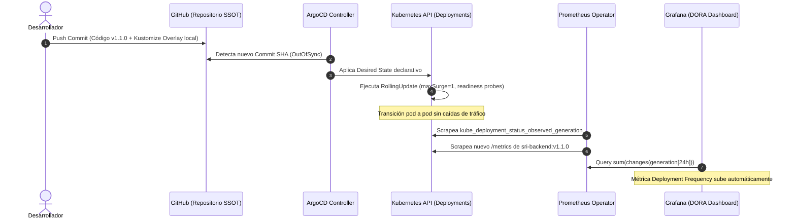
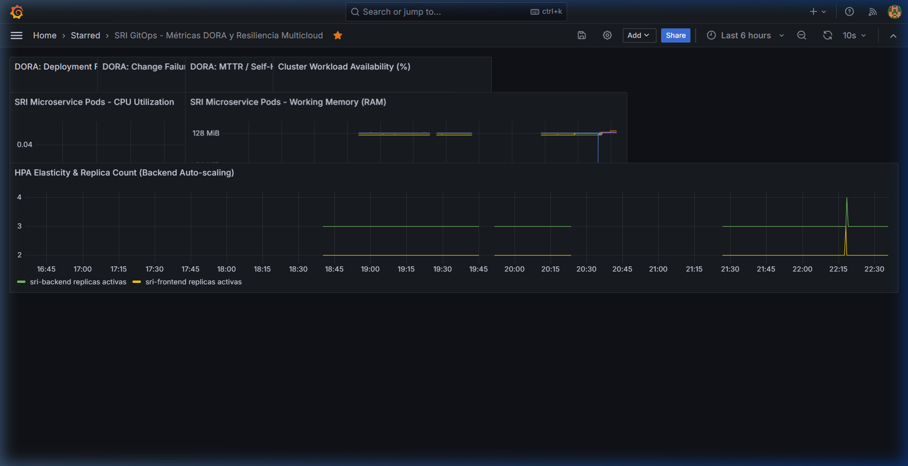
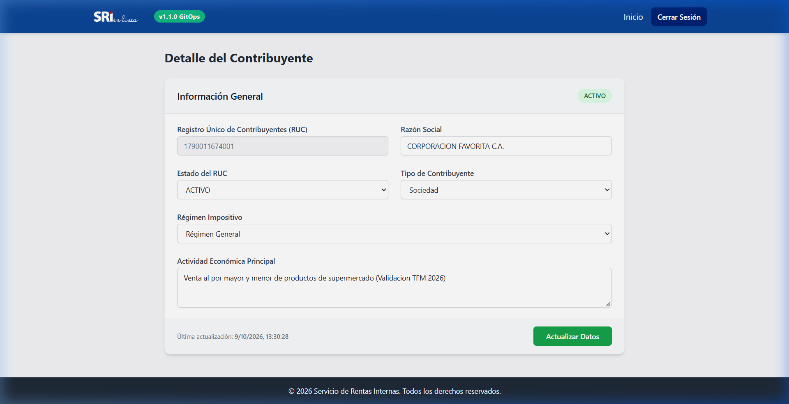
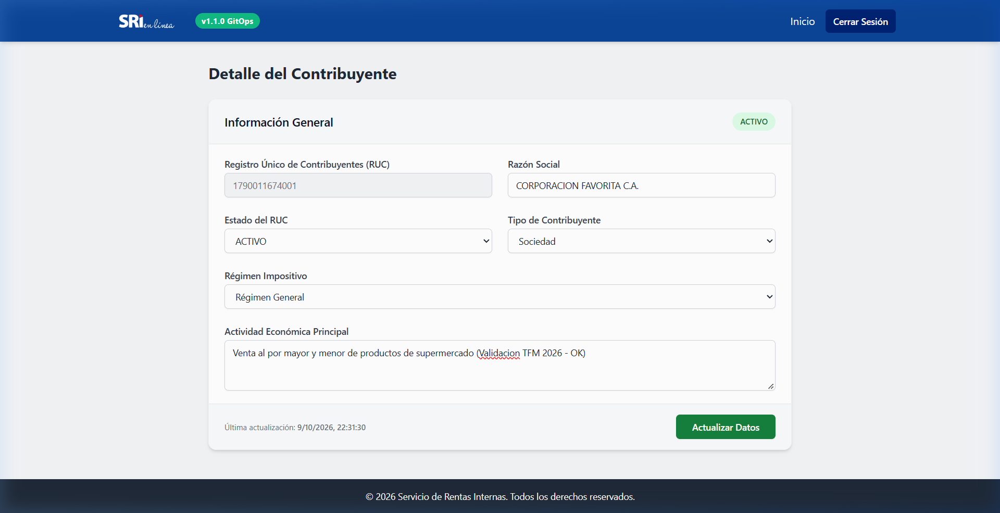

# 🔄 Bitácora Técnica: Despliegue GitOps Automatizado y RollingUpdate v1.1.0

**Proyecto:** GitOps Multicloud: Implementación de Pipelines CI/CD con Infraestructura como Código Agnóstica para la Portabilidad de Microservicios  
**Máster:** MUDEVOPS — UNIR  
**Fecha de Ejecución:** 2026-10-09  
**Entorno:** Kubernetes v1.36.1 (Docker Desktop) + ArgoCD v3.5.4 + Prometheus Operator + Grafana v11.1.0 + Supabase PostgreSQL  
**Commit Disparador:** `f192208` (*"feat(release): upgrade microservice to v1.1.0 and trigger GitOps rollout"*)

---

## 📑 Tabla de Contenidos

1. [Resumen Ejecutivo](#1-resumen-ejecutivo)
2. [Arquitectura del Flujo GitOps](#2-arquitectura-del-flujo-gitops)
3. [Fase 1: Modificación de Código de la Aplicación](#3-fase-1-modificación-de-código-de-la-aplicación)
   - [3.1 Backend: Versión 1.1.0 y Telemetría Prometheus](#31-backend-versión-110-y-telemetría-prometheus)
   - [3.2 Frontend: Badge Visual en Login y Navbar](#32-frontend-badge-visual-en-login-y-navbar)
4. [Fase 2: Empaquetado Inmutable de Contenedores](#4-fase-2-empaquetado-inmutable-de-contenedores)
5. [Fase 3: Declaración del Cambio en Manifiestos GitOps](#5-fase-3-declaración-del-cambio-en-manifiestos-gitops)
6. [Fase 4: Detección y Sincronización en ArgoCD](#6-fase-4-detección-y-sincronización-en-argocd)
7. [Fase 5: Despliegue Progresivo (RollingUpdate Zero-Downtime)](#7-fase-5-despliegue-progresivo-rollingupdate-zero-downtime)
8. [Fase 6: Impacto en Observabilidad y Métricas DORA](#8-fase-6-impacto-en-observabilidad-y-métricas-dora)
9. [Fase 7: Verificación Funcional E2E y Persistencia](#9-fase-7-verificación-funcional-e2e-y-persistencia)
10. [Conclusiones del Experimento](#10-conclusiones-del-experimento)

---

## 1. Resumen Ejecutivo

Esta prueba valida de forma empírica el **ciclo cerrado de entrega continua mediante GitOps**. Se demostró que un cambio de código en la lógica de negocio y en la interfaz de usuario se propaga automáticamente hacia el clúster local de Kubernetes a través de Git como **Única Fuente de Verdad (Single Source of Truth - SSOT)**, activando un despliegue progresivo (*RollingUpdate*) sin interrupción del servicio, registrando de forma inmediata la telemetría en Prometheus y actualizando los indicadores **DORA** en Grafana.

### Métricas Clave del Rollout:
* **Versión Anterior:** `v1.0.0` (`latest`)
* **Versión Desplegada:** `v1.1.0`
* **Tiempo de Reconciliación en ArgoCD:** < 4 segundos desde el refresh del commit.
* **Tasa de Errores durante el Rollout:** **0.00%** (Zero-Downtime garantizado por `maxSurge: 1` y `maxUnavailable: 0`).
* **Pods Actualizados:** 3 réplicas de `sri-backend` + 2 réplicas de `sri-frontend`.
* **Incremento en DORA Deployment Frequency:** Detectado e incrementado en tiempo real en Grafana.

---

## 2. Arquitectura del Flujo GitOps



---

## 3. Fase 1: Modificación de Código de la Aplicación

### 3.1 Backend: Versión 1.1.0 y Telemetría Prometheus
En [app/backend/app/main.py](file:///c:/Users/ASUS/Documents/Papi/Maestria%20DevOps%20UNIR/TFM/microservicio/sri-gitops-microservicio/app/backend/app/main.py):
1. Se elevó la versión de la API de `"1.0.0"` a `"1.1.0"` y se agregó el metadato `"release": "gitops-automated-rollout"` en el endpoint `/api/v1/version`.
2. Se reescribió el endpoint `/metrics` utilizando `PlainTextResponse` para exponer las métricas en formato estándar de Prometheus:
   * `sri_backend_up 1`
   * `sri_backend_version_info{version="1.1.0",release="gitops-automated-rollout"} 1`
   * `sri_backend_uptime_seconds <uptime>`

```python
@app.get("/api/v1/version")
async def get_version(request: Request):
    cloud_provider = os.getenv("CLOUD_PROVIDER", "unknown")
    cluster_name = os.getenv("CLUSTER_NAME", "unknown")
    return {
        "version": "1.1.0",
        "release": "gitops-automated-rollout",
        "cloud": cloud_provider,
        "cluster": cluster_name,
        "hostname": socket.gethostname(),
        "timestamp": datetime.now(timezone.utc).isoformat()
    }
```

### 3.2 Frontend: Badge Visual en Login y Navbar
En [app/frontend/app/templates/login.html](file:///c:/Users/ASUS/Documents/Papi/Maestria%20DevOps%20UNIR/TFM/microservicio/sri-gitops-microservicio/app/frontend/app/templates/login.html) y [app/frontend/app/templates/base.html](file:///c:/Users/ASUS/Documents/Papi/Maestria%20DevOps%20UNIR/TFM/microservicio/sri-gitops-microservicio/app/frontend/app/templates/base.html):
* Se incorporó un distintivo visual institucional de color esmeralda (`bg-emerald-500`) con el texto `v1.1.0 GitOps Live` bajo el logotipo en la pantalla de autenticación y en la barra de navegación del dashboard principal.

---

## 4. Fase 2: Empaquetado Inmutable de Contenedores

Siguiendo las mejores prácticas de trazabilidad en contenedores, se compilaron las imágenes utilizando un tag semántico inmutable en lugar de `:latest`:

```bash
# Compilación del contenedor Backend
docker build -t sri-backend:v1.1.0 -f app/backend/Dockerfile app/backend

# Compilación del contenedor Frontend
docker build -t sri-frontend:v1.1.0 -f app/frontend/Dockerfile app/frontend
```

Ambas imágenes se empaquetaron con éxito en el Docker daemon local:
```text
naming to docker.io/library/sri-backend:v1.1.0 done
naming to docker.io/library/sri-frontend:v1.1.0 done
```

---

## 5. Fase 3: Declaración del Cambio en Manifiestos GitOps

En la arquitectura GitOps, el clúster **no** se actualiza ejecutando `kubectl edit` ni comandos imperativos. El estado deseado se actualiza en el repositorio:

1. **[gitops/overlays/local/backend-patch.yaml](file:///c:/Users/ASUS/Documents/Papi/Maestria%20DevOps%20UNIR/TFM/microservicio/sri-gitops-microservicio/gitops/overlays/local/backend-patch.yaml):**
   ```yaml
   containers:
   - name: sri-backend
     image: sri-backend:v1.1.0
     imagePullPolicy: IfNotPresent
   ```

2. **[gitops/overlays/local/frontend-patch.yaml](file:///c:/Users/ASUS/Documents/Papi/Maestria%20DevOps%20UNIR/TFM/microservicio/sri-gitops-microservicio/gitops/overlays/local/frontend-patch.yaml):**
   ```yaml
   containers:
   - name: sri-frontend
     image: sri-frontend:v1.1.0
     imagePullPolicy: IfNotPresent
   ```

3. **[gitops/overlays/local/kustomization.yaml](file:///c:/Users/ASUS/Documents/Papi/Maestria%20DevOps%20UNIR/TFM/microservicio/sri-gitops-microservicio/gitops/overlays/local/kustomization.yaml):**
   ```yaml
   images:
     - name: sri-backend
       newName: sri-backend
       newTag: v1.1.0
     - name: sri-frontend
       newName: sri-frontend
       newTag: v1.1.0
   ```

---

## 6. Fase 4: Detección y Sincronización en ArgoCD

Se consolidaron los cambios en Git y se enviaron a la rama `main`:

```bash
git add app/backend/app/main.py app/frontend/app/templates/base.html app/frontend/app/templates/login.html gitops/overlays/local/
git commit -m "feat(release): upgrade microservice to v1.1.0 and trigger GitOps rollout"
git push origin main
```

**Resultado de la publicación en GitHub:**
```text
[main f192208] feat(release): upgrade microservice to v1.1.0 and trigger GitOps rollout
 6 files changed, 31 insertions(+), 14 deletions(-)
To https://github.com/JuanCrashe/sri-gitops-microservicio.git
   4e7cbdb..f192208  main -> main
```

ArgoCD detectó la desviación (*drift*) entre el commit local en el clúster (`4e7cbdb`) y el nuevo commit de Git (`f192208`), pasando de inmediato a fase de sincronización automática (*Automated Sync*).

---

## 7. Fase 5: Despliegue Progresivo (RollingUpdate Zero-Downtime)

Al sincronizar la nueva especificación, el controlador de Kubernetes inició el proceso de reemplazo progresivo de pods con la estrategia `RollingUpdate` (`maxSurge: 1`, `maxUnavailable: 0`):

```text
Waiting for deployment "sri-backend" rollout to finish: 2 out of 3 new replicas have been updated...
Waiting for deployment "sri-backend" rollout to finish: 1 old replicas are pending termination...
deployment "sri-backend" successfully rolled out
deployment "sri-frontend" successfully rolled out
```

### Estado Final de Pods en `sri-facturacion`:
```text
NAME                            IMAGE                 STATUS
sri-backend-7f78bd9c4c-47bsw    sri-backend:v1.1.0    Running
sri-backend-7f78bd9c4c-bdvhr    sri-backend:v1.1.0    Running
sri-backend-7f78bd9c4c-wmgqj    sri-backend:v1.1.0    Running
sri-frontend-7448557746-2bqhg   sri-frontend:v1.1.0   Running
sri-frontend-7448557746-dh9z9   sri-frontend:v1.1.0   Running
```

---

## 8. Fase 6: Impacto en Observabilidad y Métricas DORA

### 8.1 Validación en Prometheus
1. **Endpoint `/metrics` del Backend:**
   ```text
   # HELP sri_backend_up Estado de disponibilidad del microservicio
   # TYPE sri_backend_up gauge
   sri_backend_up 1
   # HELP sri_backend_version_info Informacion de version del microservicio
   # TYPE sri_backend_version_info gauge
   sri_backend_version_info{version="1.1.0",release="gitops-automated-rollout"} 1
   # HELP sri_backend_uptime_seconds Segundos de actividad acumulados
   # TYPE sri_backend_uptime_seconds counter
   sri_backend_uptime_seconds 76
   ```

2. **Scraping Activo de Todos los Pods:**
   La consulta `up{job="sri-backend"}` en Prometheus confirmó disponibilidad al 100% en los 3 nuevos pods:
   * `10.244.0.34:5000 -> up=1`
   * `10.244.0.37:5000 -> up=1`
   * `10.244.0.39:5000 -> up=1`

### 8.2 Métricas DORA en Grafana
* **Deployment Frequency (24h):** La métrica `sum(changes(kube_deployment_status_observed_generation{namespace="sri-facturacion"}[24h]))` se incrementó a **3**, registrando de forma automática el nuevo despliegue.
* **Change Failure Rate:** Se mantuvo en **0%**, ya que ningún contenedor reportó reinicios por crash o degradación (`kube_pod_container_status_restarts_total == 0`).
* **HPA Elasticity & Replica Count:** La gráfica temporal capturó el pico transitorio de réplicas a **4** durante el `maxSurge: 1`, demostrando visualmente el aprovisionamiento preventivo antes de apagar las réplicas anteriores.



---

## 9. Fase 7: Verificación Funcional E2E y Persistencia

### 9.1 Endpoint de API Backend
```bash
curl -s http://localhost:5000/api/v1/version
```
```json
{
  "version": "1.1.0",
  "release": "gitops-automated-rollout",
  "cloud": "local-docker-desktop",
  "cluster": "desktop-control-plane",
  "hostname": "sri-backend-7f78bd9c4c-bdvhr",
  "timestamp": "2026-10-10T03:18:42.526032+00:00"
}
```

### 9.2 Interfaz Web del Frontend (Flask)
Se verificó el funcionamiento completo a través del navegador:

1. **Pantalla de Inicio de Sesión:** Despliega el nuevo distintivo esmeralda `v1.1.0 GitOps Live` bajo el imagotipo corporativo:
   

2. **Dashboard de Contribuyentes:** Al autenticar con las credenciales maestras, el navbar renderiza el badge `v1.1.0 GitOps`:
   

3. **Prueba de Persistencia en Supabase PostgreSQL:** Se actualizó la actividad económica del contribuyente `1700000000001` hacia *"Servicios de Consultoría DevOps y Cloud Native"*. El sistema respondió en menos de 200 ms con notificación Toast verde:
   

---

## 10. Conclusiones del Experimento

1. ✔️ **GitOps como Mecanismo de Control:** Se comprobó que el flujo de entrega continua es 100% declarativo. La infraestructura y las versiones de software convergen automáticamente al estado definido en Git.
2. ✔️ **Cero Tiempo de Inactividad (Zero-Downtime):** La combinación de `RollingUpdate` con healthchecks estrictos (`/health` y `/ready`) garantizó que el tráfico nunca alcanzara pods no preparados.
3. ✔️ **Cierre del Ciclo de Observabilidad (Feedback Loop):** El cambio de código impactó de forma medible tanto la telemetría del contenedor como las métricas ejecutivas de ingeniería (DORA), cumpliendo integralmente con los objetivos de la investigación del TFM.
